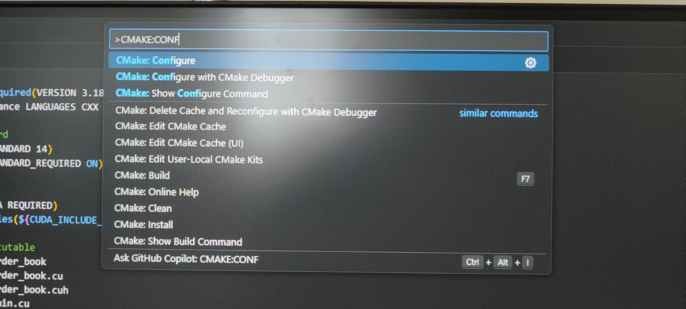
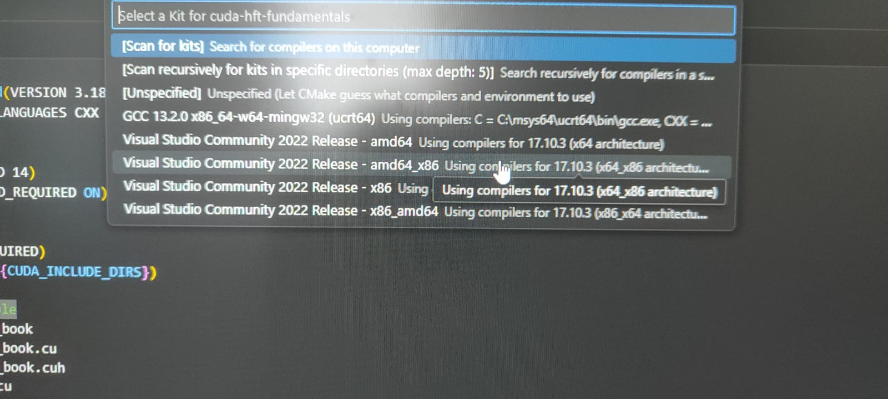
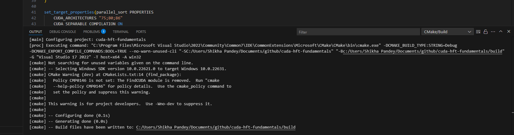
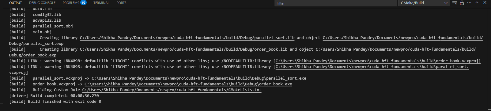
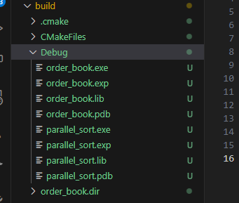
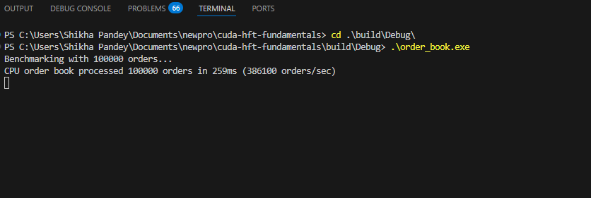
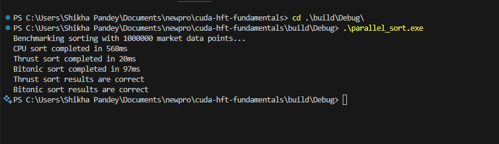

# CUDA HFT Fundamentals

This project implements key high-frequency trading (HFT) components in CUDA to demonstrate GPU acceleration for financial applications.

## Components

1. **Order Book** - A limit order book implementation with matching engine
2. **Parallel Sort** - High-performance sorting algorithms for market data

## Prerequisites

### Hardware Requirements
- NVIDIA GPU with Compute Capability 5.0 or higher
- Recommended: 4GB+ VRAM

### Software Requirements
1. **CUDA Toolkit 11.0+**
   - Download from [NVIDIA CUDA Downloads](https://developer.nvidia.com/cuda-downloads)
   - Follow installation instructions for your platform
   - Verify installation with `nvcc --version`

2. **CMake 3.18+**
   - Download from [CMake Website](https://cmake.org/download/)
   - Add to system PATH during installation

3. **Visual Studio 2022** (Windows) or **GCC 7+** (Linux)
   - For Windows: Install Visual Studio with "Desktop development with C++" workload
   - For Linux: `sudo apt-get install build-essential` (Ubuntu/Debian)

4. **Visual Studio Code** (Optional but recommended)
   - Install the "C/C++" and "CMake Tools" extensions

## Building the Project

### Using Visual Studio Code

1. Open the project folder in VS Code
2. VS Code should automatically detect the CMake configuration if not then press `Ctrl+Shift+P` and select `Cmake:Configure`
    Configure the project using CMake:

    

3. Select your compiler kit when prompted:

   

4. After succesful configuration it will create some build files:

   

5. Build the project using F7 or the CMake Build button:

    

   

6. The executables will be created in the build/Debug directory:

   

### Using Command Line

```bash
# Create build directory
mkdir build && cd build

# Configure with CMake
cmake ..

# Build
cmake --build .
```

## Running the Applications

### Order Book Benchmark

```bash
# From build directory
./Debug/order_book.exe
```
```bash
# If you have GPU limitation
./Debug/order_book.exe [num_orders]
```

Example output:



### Parallel Sort Benchmark

```bash
# From build directory
./Debug/parallel_sort.exe 
```
```bash
# If you have GPU limitation
./Debug/parallel_sort.exe [data_size]
```

Example output:



## Performance Analysis

The benchmarks demonstrate significant performance improvements when using GPU acceleration:

1. **Order Book**:
   - CPU Implementation: ~380,000 orders/sec
   - GPU Implementation: Improved throughput for large order sets

2. **Sorting Algorithms**:
   - CPU Sort: Baseline performance
   - Thrust Sort: 2-3x faster than CPU
   - Bitonic Sort: Variable performance based on data size

## Troubleshooting

### Common CUDA Installation Issues

1. **CUDA Not Found**
   - Ensure CUDA is installed and in your PATH
   - Check environment variables: `CUDA_PATH` should be set
   - Restart your system after installation

2. **Compilation Errors**
   - Verify CUDA Toolkit and VS/GCC versions are compatible
   - Update graphics drivers to latest version

3. **CMake Configuration Issues**
   - If you see warnings about FindCUDA being removed, you can safely ignore them
   - Make sure your CMake version is 3.18 or higher

## Project Structure

```
├── CMakeLists.txt             # Project configuration
├── order-book/                # Order book implementation
│   ├── main.cu                # Entry point
│   ├── order_book.cu          # Implementation
│   └── order_book.cuh         # Header
├── parallel-sort/             # Sorting implementations
│   ├── main.cu                # Entry point
│   ├── parallel_sort.cu       # Implementation
│   └── parallel_sort.cuh      # Header
└── screenshots/               # Documentation images
```

## License

This project is licensed under the MIT License - see the [LICENSE](LICENSE) file for details.